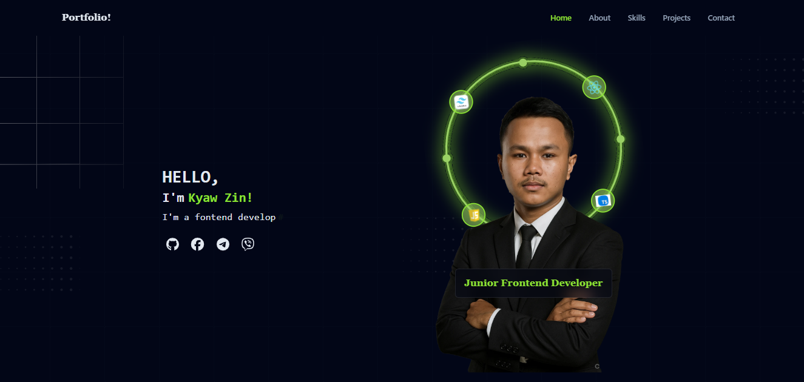

# Kyaw Zin Win's Portfolio 🚀

A modern, responsive portfolio website built with Vite, React, TypeScript and Tailwind CSS. This portfolio showcases my skills, projects, and professional journey with smooth animations and interactive elements.

## 🌐 Live Demo

**[View Portfolio](https://kyaw-zin-win-s-portfolio.vercel.app/)**

## ✨ Key Features

### 🎨 Modern Design
- **Responsive Layout**: Optimized for desktop, tablet, and mobile devices
- **Dark Theme**: Professional dark theme with accent colors
- **Smooth Animations**: GSAP and Framer Motion powered animations
- **Interactive Elements**: Hover effects and micro-interactions

### 🧠 Smart Components
- **Responsive Project Carousel**: One-by-one project navigation with swipe support
- **Dynamic Skill Tree**: Interactive skill visualization with tech associations
- **Animated Contact Form**: Real-time validation with toast notifications
- **Scroll-based Navigation**: Auto-highlighting active sections

### 🛠 Technical Features
- **TypeScript**: Full type safety throughout the application
- **Component Architecture**: Modular, reusable React components
- **Performance Optimized**: Lazy loading and efficient re-renders
- **Accessibility**: ARIA labels and keyboard navigation support

## 🛠 Tech Stack

### Core Technologies
- **Frontend**: React 19 with TypeScript
- **Build Tool**: Vite for fast development and building
- **Styling**: Tailwind CSS v4 for utility-first CSS
- **Animation**: GSAP and Framer Motion for smooth animations

### Libraries & Tools
- **Icons**: Lucide React + FontAwesome
- **Forms**: EmailJS for contact form functionality
- **Notifications**: React Hot Toast for user feedback
- **Linting**: ESLint with TypeScript support

## 📸 Screenshots



## 🚀 Getting Started

### Prerequisites
- Node.js (v18 or higher)
- npm or yarn package manager

### Installation

1. **Clone the repository**
   ```bash
   git clone https://github.com/kyawzin17/Kyaw-Zin-Win-s-Portfolio
   cd your-repo
   ```

2. **Install dependencies**
   ```bash
   npm install
   ```

3. **Start development server**
   ```bash
   npm run dev
   ```

4. **Build for production**
   ```bash
   npm run build
   ```

5. **Preview production build**
   ```bash
   npm run preview
   ```

## 📁 Project Structure

```
src/
├── components/          # Reusable UI components
│   ├── Header.tsx      # Navigation header
│   ├── SkillBadge.tsx  # Skill display component
│   ├── SkillNode.tsx   # Skill tree node
│   ├── TechTree.tsx    # Technology tree visualization
│   └── TypingHeading.tsx # Animated heading component
├── pages/              # Page components
│   ├── About.tsx       # About section
│   ├── Contact.tsx     # Contact form with validation
│   ├── Footer.tsx      # Footer section
│   ├── Home.tsx        # Hero section
│   ├── Project.tsx     # Responsive project carousel
│   └── Skills.tsx      # Skills section with tree
├── hooks/              # Custom React hooks
│   └── useAppContext.tsx # App context management
├── assets/             # Static assets
└── App.tsx            # Main application component
```

## 🎯 Component Highlights

### Project Carousel
- **Responsive Design**: Shows 1 card on mobile, centered on tablet, all on desktop
- **Multiple Navigation**: Buttons, keyboard arrows, touch swipe, dot indicators
- **Smooth Transitions**: Framer Motion powered animations
- **Accessibility**: Full keyboard and screen reader support

### Contact Form
- **Real-time Validation**: Input validation with error messages
- **Email Integration**: EmailJS for reliable form submission
- **User Feedback**: Toast notifications for success/error states
- **Accessibility**: Proper ARIA labels and focus management

### Skill Tree
- **Interactive Visualization**: Tech skill associations
- **Brand Colors**: Technology-specific color coding
- **Smooth Animations**: GSAP powered interactions
- **Responsive Layout**: Adapts to different screen sizes

## 🔧 Configuration

### Environment Variables
Create a `.env` file in the root directory:

```env
# EmailJS Configuration (optional - for contact form)
VITE_EMAILJS_SERVICE_ID=your_service_id
VITE_EMAILJS_TEMPLATE_ID=your_template_id
VITE_EMAILJS_PUBLIC_KEY=your_public_key
```

### Customization
- **Colors**: Modify Tailwind config for theme customization
- **Content**: Update data in page components
- **Animations**: Adjust GSAP and Framer Motion settings
- **Styling**: Modify component CSS classes

## 📱 Responsive Breakpoints

- **Mobile**: < 768px
- **Tablet**: 768px - 1024px  
- **Desktop**: > 1024px

## 🎨 Design System

### Color Palette
- **Background**: `#0a0a0a` (dark theme)
- **Primary**: Custom accent colors
- **Secondary**: Complementary colors
- **Text**: Light colors for dark theme contrast

### Typography
- **Font System**: System fonts with fallbacks
- **Heading**: Serif font for headings
- **Body**: Sans-serif for readability

## 🤝 Contributing

1. Fork the repository
2. Create your feature branch (`git checkout -b feature/AmazingFeature`)
3. Commit your changes (`git commit -m 'Add some AmazingFeature'`)
4. Push to the branch (`git push origin feature/AmazingFeature`)
5. Open a Pull Request

## 📞 Contact

**Kyaw Zin Win**
- **Portfolio**: [kyaw-zin-win-s-portfolio.vercel.app](https://kyaw-zin-win-s-portfolio.vercel.app/)
- **GitHub**: [@kyawzin17](https://github.com/kyawzin17)
- **LinkedIn**: [kyaw-zin-win-96044a400](https://linkedin.com/in/kyaw-zin-win-96044a400)

## 📝 License

This project is licensed under the MIT License - see the [LICENSE](LICENSE) file for details.

## 🙏 Acknowledgments

- **GSAP**: For amazing animation capabilities
- **Framer Motion**: For React animation library
- **Tailwind CSS**: For utility-first CSS framework
- **Lucide Icons**: For beautiful icon set
- **Vite**: For fast build tool and development experience

---

**⭐ Star this repo if you find it helpful!**